# Custom Docker Containers/Images in UNRAID (V1.0)
In order to properly setup a custom docker image in the unraid GUI to allow for GUI based control of the container, you will need to make use of the template system. In short, you will create a new container in the UI,
then use the built in options to configure the basics of the image and add the required ports, enviornment variables, lables or devices.

A couple of foundational understandings to have to better know what is taking place in this process:
- Docker Container Basics (https://docs.docker.com/get-started/docker-overview/)
- Docker Registries, Repositories and Images (https://docs.docker.com/registry/)
- An understanding of Ports in a computer and container, as well as docker port mapping (https://docs.docker.com/engine/network/#published-ports)
- Envrionment variables 
- Volumes, A.K.A: Sharing data between a running container and the host machine (https://docs.docker.com/engine/storage/volumes/)

It is important to note that docker containers are inherently [Ephemeral](https://docs.docker.com/build/building/best-practices/#create-ephemeral-containers), meaning they SHOULD be able to be destroyed at any moment without losing
important data. This is accomplished through volumes (primarily).

## Guide
Below are the steps I use to regularly set up my own containers on my UNRAID machine that do not have a template set up. Important note: when on many of the UNRAID UI pages, if available, there will be a button/icon in the
top right which looks like:  
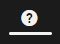  
This will provide additional context for options and elements on the page as you work.
### Using UNRAID UI to add container
At the bottom of the docker page you'll find the option to "Add Container".  
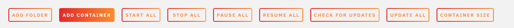  
Once you have entered the page you should ensure you have "Advanced View" On (the toggle in the top right!).  
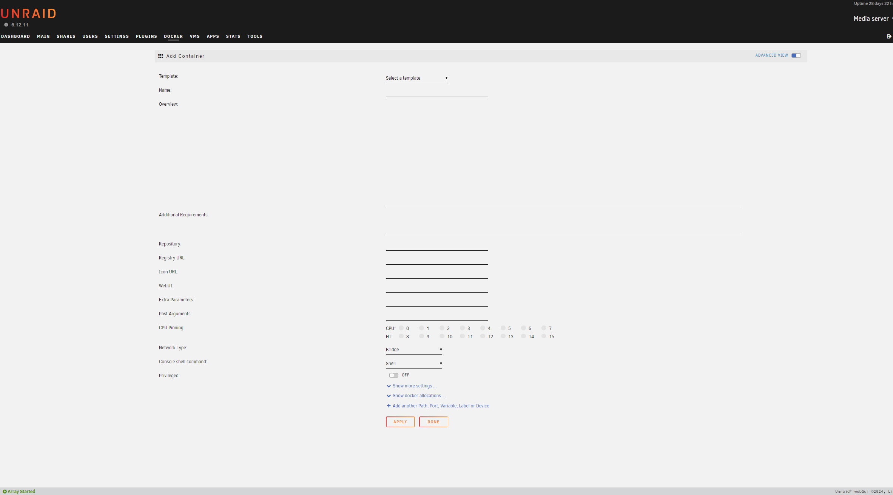  
### Image and repository setup
First, you'll need to provide a **name** for your docker container within the UI and the host machine. This is the name that will appear when you go to your "Docker" tab in the UI.  
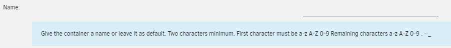  
Optionally you can provide an "**Overview**" or description for the image, this is good practice when you return and need a refresher. Remember, you will NOT rememeber what you were doing with this image in 3 months. (Write a description)  
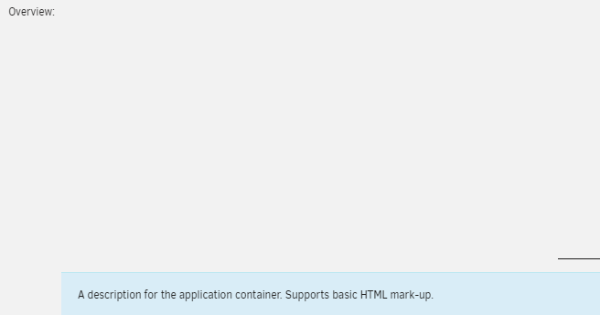  
Time to specify a **repository**! "What is a repository?" you ask? Read this: https://docs.docker.com/registry/ most of the time you will just provide a value of "(creator)/(image)". For example: When creating a [Dozzle](https://dozzle.dev/) container
a value of "amir20/dozzle" is provided. This is also where you could provide a specific image version value (by providing a ":(version number)" at the end).  
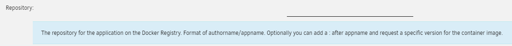  
**Registry URL** is where you will specifify the path to the repository on the docker hub. This should be the path to the image. Using the previous example: For a [Dozzle](https://dozzle.dev/) container a value of "https://hub.docker.com/r/amir20/dozzle/" 
would be provided.  
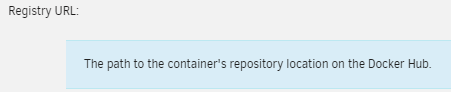  
**Icon URL** is an optional parameter to allow you to provide a link to a desired icon.  
**WebUI** is where you are providing the UI (and only the ui, this does not edit the container) with a link to the container's frontend (if it has one). This setting can use contextual string replacement! A value of "http://[IP]:[PORT:8080]/" would mean: "At the host IP, go to port 8080".  
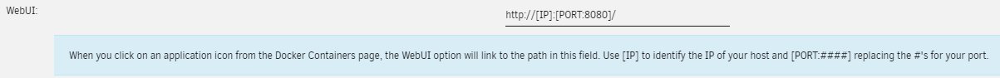  
**Extra Parameters** is an area to provide additional docker commands to the container at runtime. Please see: https://docs.docker.com/reference/run/. This would be the place to pass in container/image specific settings or configuration that may be required for the image. In most cases this is left blank.   
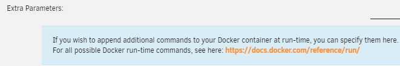  
**Post Arguments** are for additional arguments AFTER container definition. Another example of an option often left blank.  
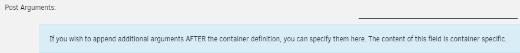  
**CPU Pinning** allows you to lock the containers to only use certian CPUs on the host machine. Typically this is left blank, unless a container is problematic and causes CPU overload.  
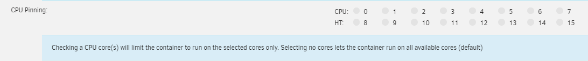  
**Network Type** decides how the docker container will interact with the network. The most common choice for this is "Bridge". This networking system allows you to control which docker containers are allowed to talk to one another. More information can be found at: https://docs.docker.com/engine/network/.  
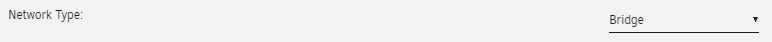  
**Console shell command** decides if the console will be in sh or bash when you enter it though the UI. You can often go with shell if you dont know, but bash will provide more options on the scant few times you use the console.  
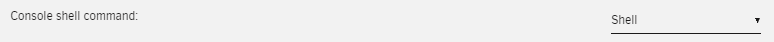  
**Privileged** is a toggle that decides if the docker container is allowed to use host level permissions. THIS IS A DANGEROUS ONE TO HAVE ON. Please read more here: https://docs.docker.com/engine/reference/run/#runtime-privilege-and-linux-capabilities  
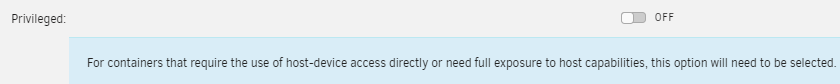  
### Custom Ports, Variables, Paths (Volumes), etc.
Next you will have the option to provide custom PORTS, VARIABLES, and more. You add them by clicking on the "Add another Path, Port, Variable, Label or Device" option.  
| Option Modal | Explaination |
|------------- |------------- |
| 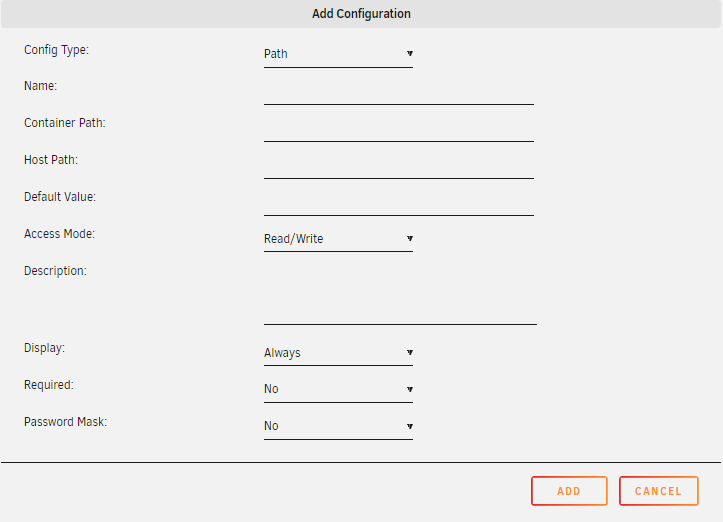 | Adding a "Path" is defining a Docker **Voume** on the container.  **Name** option is only for the UI.  **Container Path** is the filepath on the container.  **Host Path** is the path on the host that you want to map.  **Default Value** allows you to specify a default in the event that is left empty.  **Access Mode** controls the permissions the container will have in the volume. |
| 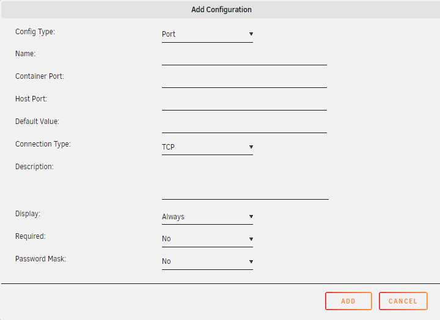 | Adding a "Port" is is how you map a host port to a container port for access.  **Name** option is only for the UI.  **Container Port** is the port on the CONTAINER you want mapped.  **Host Port** is the port on the HOST you want mapped.  **Default Value** allows you to specify a default in the event that is left empty.  **Connection Type** The network connection type this port supports, most web UI's are TCP. |
| 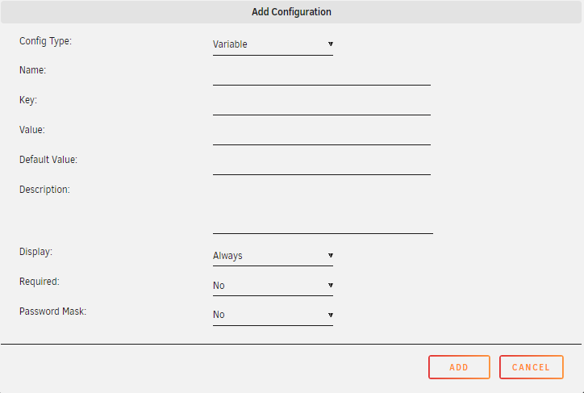 | Adding a "Variable" is defining an environment variable on the container.  **Name** option is only for the UI.  **Key** is defining the name of the env var on the container (best practice is for this to be all caps).  **Value** is the acutal value you want this environment variable to be holding on the container.  **Default Value** allows you to specify a default in the event that is left empty. |
Label and Device are a little more in depth for this guide, so they have been skipped as of right now.  
### Finalizing
Finally you should be in a good spot to stand up your custom container. To finalize you just click "Apply" and you should be good to go!